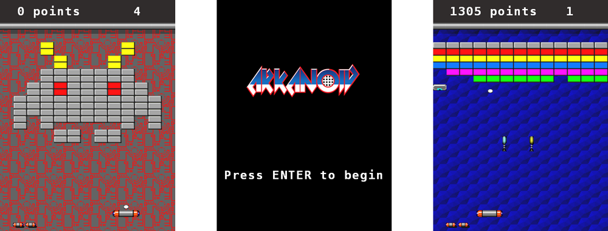

Arkanoid
========

Ce programme est une implémentation en C++ du jeu de casse-briques Arkanoid,
réalisé par Méline Bour--Lang et Ludovic Muller dans le cadre de l'UE de
programmation avancée du premier semestre de master.

Cette version comprend plusieurs niveaux, lus à partir de fichiers texte, ainsi
que l'ensemble des bonus de la version originale.



## Commandes en jeu

Il est possible de jouer à la souris comme au clavier.
- Menus : touche Entrée ou clic
- Déplacement : flèches directionnelles ou déplacement de la souris
- Lancement de la balle / des lasers : espace ou clic
- Passage au niveau suivant (à des fins de test) : touche N
- Activer/désactiver le mode cylindrique : touche C

## Prérequis

### Si vous souhaitez utiliser CMake :
Il faut avoir une version de `cmake` relativement récente.
Sur une distribution à jour, un simple `sudo apt install cmake` devrait faire
l'affaire, sinon il faudra compiler depuis les sources.

### SDL2

Il faudra également avoir SDL2 sur sa machine. Pour installer tout le
nécessaire, lancez la commande suivante :
`sudo apt install libsdl2-dev libsdl2-image-dev libsdl2-ttf-dev`

Il est possible d'utiliser Qt Creator pour développer et builder le projet,
mais cela n'est pas obligatoire.

## Compiler le projet

### Avec `make`

Pour compiler simplement le projet depuis les sources, un simple `make` suffit.

Pour formatter le code, on peut utiliser `make format`.

Pour lancer le projet, une tâche spécifique existe : `make run`.

Pour supprimer les fichiers générés lors de la compilation, il est possible
d'utiliser `make clean`.

### Avec QtCreator + `cmake`

Utiliser QtCreator comme habituellement.

## Niveaux

Un niveau est décrit par un fichier déposé dans le répertoire `levels`.

Il possède une structure de la forme :

```
A B C
x x x ... x x x
x x x ... x x x
      ...
x x x ... x x x
x x x ... x x x
```

avec :
  - `A` : le nombre de lignes
  - `B` : le nombre de colonnes (inférieur ou égal à 13)
  - `C` : l'identifiant du sprite d'arrière-plan (1 à 6)
  - `x` : un entier décrivant le type de brique sur la grille,
    avec `0` comme étant un emplacement vide

Quelque soit le nombre de colonnes, le niveau est automatiquement centré dans la
fenêtre.
